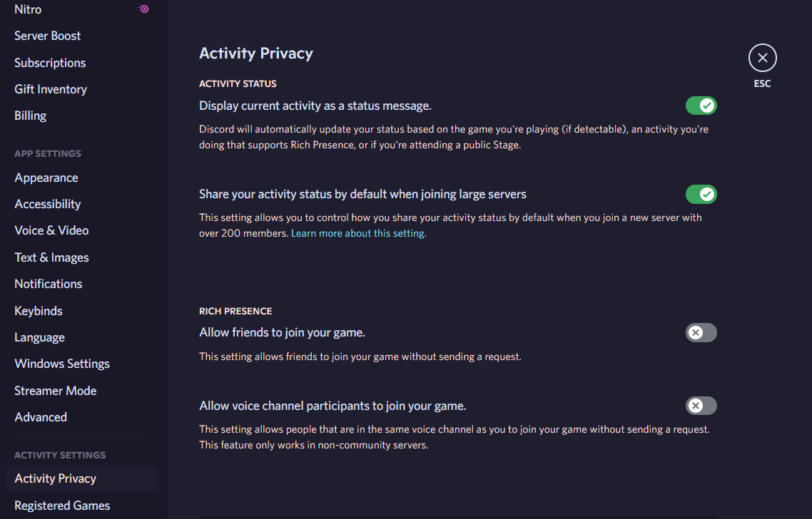
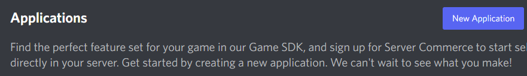
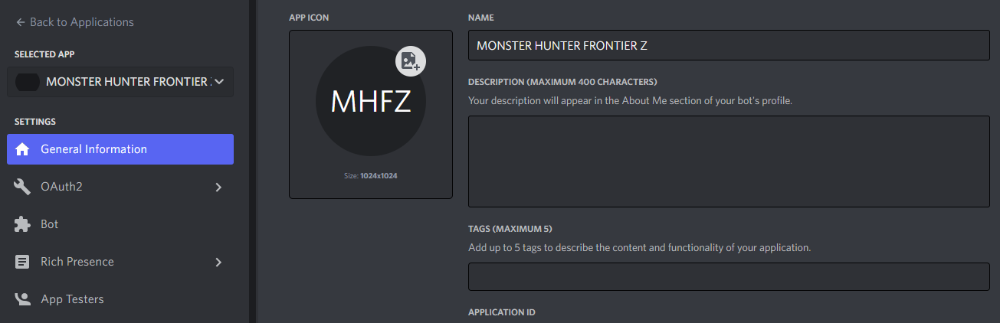
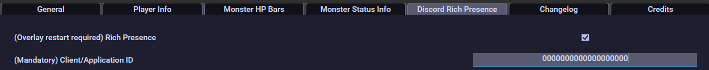
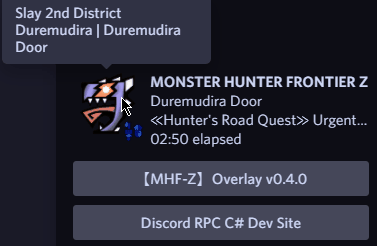
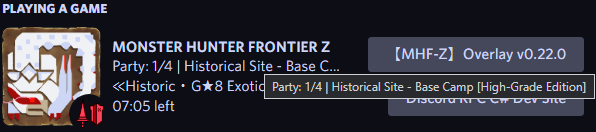
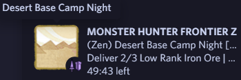

# Frequently Asked Questions

- [Frequently Asked Questions](#frequently-asked-questions)
  - [How to Enable Discord Rich Presence?](#how-to-enable-discord-rich-presence)
  - [How to Enable Speedrun Categories \& Zen Mode?](#how-to-enable-speedrun-categories--zen-mode)
  - [How to Record Videos with the Overlay?](#how-to-record-videos-with-the-overlay)
  - [My game slows down when recording with the Overlay, what should I do?](#my-game-slows-down-when-recording-with-the-overlay-what-should-i-do)
  - [How to Enable Quest Logging?](#how-to-enable-quest-logging)
  - [What does the version numbers mean?](#what-does-the-version-numbers-mean)
  - [Where do I find my logs or crash files?](#where-do-i-find-my-logs-or-crash-files)
  - [Does this software support other operating systems?](#does-this-software-support-other-operating-systems)
  - [The software messed up my computer or my game, what should I do?](#the-software-messed-up-my-computer-or-my-game-what-should-i-do)
  - [I would like to send a review or feedback for the overlay, where do I send it?](#i-would-like-to-send-a-review-or-feedback-for-the-overlay-where-do-i-send-it)
  - [How can I prevent the overlay from changing the game's resolution when launching it?](#how-can-i-prevent-the-overlay-from-changing-the-games-resolution-when-launching-it)
  - [I cannot run the setup executable, what should I do?](#i-cannot-run-the-setup-executable-what-should-i-do)
  - [How to import/export settings from the overlay?](#how-to-importexport-settings-from-the-overlay)
  - [How to check the downloaded file hashes?](#how-to-check-the-downloaded-file-hashes)
    - [Graphical User Interface](#graphical-user-interface)
    - [Command Line Interface](#command-line-interface)
  - [What files and folders are affected by the overlay?](#what-files-and-folders-are-affected-by-the-overlay)
  - [How do I set up my controller/gamepad for the overlay program?](#how-do-i-set-up-my-controllergamepad-for-the-overlay-program)
  - [How does this overlay compare to other Monster Hunter overlays?](#how-does-this-overlay-compare-to-other-monster-hunter-overlays)
  - [What does Effective HP and True HP mean?](#what-does-effective-hp-and-true-hp-mean)
  - [How did the overlay come to be?](#how-did-the-overlay-come-to-be)
  - [Does X feature of the overlay slow down my computer?](#does-x-feature-of-the-overlay-slow-down-my-computer)
  - [Is the overlay malware?](#is-the-overlay-malware)
  - [What is the database used for?](#what-is-the-database-used-for)
  - [Does the overlay affect the game?](#does-the-overlay-affect-the-game)
  - [My question isn't answered here, how can I contact the developers?](#my-question-isnt-answered-here-how-can-i-contact-the-developers)

## How to Enable Discord Rich Presence?

- In Discord, My Account -> Activity Privacy -> Check "Display current activity as a status message"



- [Discord Developer Portal](https://discord.com/developers/applications) -> New Application -> Name it "MONSTER HUNTER FRONTIER Z"



- In Developer Portal, General Information -> Copy Application ID



- In Overlay Settings, Paste into Overlay Settings Discord Rich Presence Application/Client ID (The ID also shows up in OAuth2 section as Client ID)





## How to Enable Speedrun Categories & Zen Mode?

Use the preset option found in the General tab. Keep reading if you want to know how to do it manually.

- Speedrun Mode Categories: SOLO ONLY. Enable the required settings in the Quest Logs section, disable **everything** else, including Quest Pace Color (Monster Icon, Quest Timer + Percentage, KBM Layout, Personal Best and Discord Rich Presence optional)

- Time Attack: Do not use diva skills.
- Freestyle: Use diva skills with/without Secret Technique Style Rank Skill.

**Important**: It is recommended to make a backup of the `MHFZ_Overlay.sqlite` file periodically. The file is located inside the database folder, which is inside your game folder. Don't lose your speedrun records!



- Zen Mode: Disable **everything** (Monster Icon and Discord Rich Presence optional)



~~Congrats, now you won't be accused of cheating~~

## How to Record Videos with the Overlay?

1. [Download OBS](https://obsproject.com/)
2. Go to the Sources section, click Add Source, select Window Capture, select Create new, click OK.
3. Select the Window dropdown, choose mhf.exe.
4. Make sure Window Match Priority is set to "Match title, otherwise find window of same type"
5. Click Add Source again, select Window Capture, select Create new, click OK.
6. Select the Window dropdown, choose MHFZ_Overlay.exe (if the option is not shown, load the overlay first and retry)
7. For Capture Method, choose Windows 10
8. Make sure Window Match Priority is set to "Match title, otherwise find window of same executable"
9. Happy Hunting!

## My game slows down when recording with the Overlay, what should I do?

If you're experiencing a slowdown in your game while recording with OBS and using the overlay, there are a few potential reasons and solutions to consider:

- System resources: If your computer has limited CPU or GPU resources then recording gameplay with OBS and running an overlay can be resource-intensive. Try closing any unnecessary programs, lowering in-game graphics settings, or upgrading your hardware to meet the requirements for recording and overlay usage.

- Overlay settings: The settings of the overlay can also impact performance. Make sure your overlay settings are optimized for performance, such as using lower resolution and disabling any unnecessary features. Try one of the configuration presets, such as Speedrun, Zen or HP only. Try setting Rendering Mode to either Software or Hardware. As a last resort, try lowering the Refresh Rate, at the cost of stats accuracy.

- OBS settings: Review your OBS settings to ensure they are optimized for recording. Adjusting bitrate, resolution, and frame rate settings in OBS can help improve performance while recording with an overlay.

- Test on different hardware: Test your overlay program and OBS on different hardware configurations to determine if the issue persists across different systems, which can help identify if it's a hardware-specific issue.

## How to Enable Quest Logging?

1. Go to Mezeporta, load the Overlay.
2. Press `Shift+F1`, go to Quest Log tab.
3. Go to Settings tab inside the Quest Log tab, toggle Quest Logging.
4. The overlay should detect the folder location of the game and make a folder named `database` inside the game folder, creating the `MHFZ_Overlay.sqlite` in that database folder if there isn't one.
5. If you already had a database before, you can rename it to `MHFZ_Overlay.sqlite` and place it in that database folder. It should keep your past quest information.
6. Be careful if you re-install the game, make a backup of the database folder first.

## What does the version numbers mean?

We use [semantic versioning](https://semver.org/) to number our releases. In semantic versioning, versions are represented as "major.minor.patch" numbers, such as "1.2.3". Here's what each number signifies:

- **Major version**: A change in the major version number indicates a significant change that may require you to upgrade your software. This typically includes breaking changes that are not backwards-compatible.

- **Minor version**: A change in the minor version number indicates new features or enhancements that have been added to the software.

- **Patch version**: A change in the patch version number indicates bug fixes and small improvements.

Major version zero (0.y.z) is for initial development. Anything MAY change at any time. The public API SHOULD NOT be considered stable.

We provide [release notes](https://github.com/DorielRivalet/mhfz-overlay/blob/main/CHANGELOG.md) with each new version of the software, which describe the changes that have been made and how they may affect you. If upgrading to a new version requires any specific instructions, we will provide these as well.

If you have any questions about versioning or how to upgrade your software, please don't hesitate to contact us for support.

## Where do I find my logs or crash files?

In the folder where `MHFZ_Overlay.exe` is (or in the `app-x.y.z` folder), there should be a `logs` folder with a log file named `logs.log`. This file is useful for debugging the program. You should only send the relevant text in the logs when reporting an issue, not the whole file, so only send the last lines where appropiate. Look out for words such as WARN, ERROR, or FATAL.

## Does this software support other operating systems?

As detailed in the program's *about* section, this software is meant for Windows 10. It might work with other versions of Windows, but it may function with less stability.

## The software messed up my computer or my game, what should I do?

Please read the [license](https://github.com/DorielRivalet/mhfz-overlay/blob/main/LICENSE.md) fully before utilizing the software.

## I would like to send a review or feedback for the overlay, where do I send it?

Sure thing! [Click here](https://forms.gle/hrAVWMcYS5HEo1v7A) and thank you for your feedback.

## How can I prevent the overlay from changing the game's resolution when launching it?

The fix would have to come from Window's side, not the overlay.

## I cannot run the setup executable, what should I do?

Make sure to run as Administrator.

## How to import/export settings from the overlay?

Open the overlay settings, go to General tab, press the Open Settings Folder button. This is where your user settings file is stored. If you wish to replace current settings from another settings file:

1. Close the overlay.
2. Copy/Paste and overwrite, with the current same folder and file name.
3. Start the overlay.

Also keep in mind that when you update the overlay from the program itself, the following happens:

1. Your current settings are automatically and temporarily backed up.
2. Restores the settings from this backup.
3. The backup file is automatically deleted.

This way, there are no lost settings when updating, and you don't have to make the backup manually.

The location of any previous settings are in the subfolders of `%LocalAppData%/Doriel_Rivalet`. Recommended to sort by date modified.

## How to check the downloaded file hashes?

### Graphical User Interface

1. Download [DevToys](https://www.microsoft.com/store/apps/9PGCV4V3BK4W).
2. In *DevToys*: Go to Generators > Checksum.
3. Enable Uppercase.
4. Select SHA256 as Hashing Algorithm.
5. Drag and drop the file.
6. Copy/Paste into Output Comparer the hash provided by the developer.
7. You should get the message `The hashes are the same.`.

### Command Line Interface

1. Open PowerShell in the folder where the files are and enter the command `Get-FileHash (drag and drop your file into the terminal)`.
2. If the command worked, you should get SHA256 in the `Algorithm` column, and the hash value in the `Hash` column, along with the Path provided.
3. Check if the hashes provided by the developer are the same as the hashes provided by PowerShell. If they are the same, the files shouldn't have been tampered with.

## What files and folders are affected by the overlay?

`MHFZ_OverlaySetup.exe` is the setup file for installing the overlay. After installation, a shortcut gets made to `%LocalAppData%\MHFZ_Overlay\MHFZ_Overlay.exe`.

Upon first usage, a `database` folder is made on the location of your current `mhf.exe` process. Inside the `database` folder are the following:

- `MHFZ_Overlay.sqlite`: the database file where all your past quest logs and other information is stored. Keep this backed up.

- `previous-version.txt`: used by the program to keep track of previous versions. **Do not edit this** unless told to by the developer or if you really know what you are doing.

If you ever update the database from the program, an additional folder gets made inside the `database` folder, called `backups`. This is where database backups are stored. The `database` folder is also used as the initial directory for files you want to save when clicking the download button in the overlay configuration window.

Additionally, in the overlay folder a file called `reference_schema.json` is made, which is used by the overlay program for local/client-based database integrity checks. **Do not edit this file**. If you are prompted by the program to delete it, then do so.

If you are using multiple `mhf.exe` files, then the overlay would make a database folder in each of their directories upon usage (it checks the current directory location of the current `mhf.exe` running, at database initialization).

For debugging purposes, the overlay also includes a log file called `logs.log`, see more information [here](#where-do-i-find-my-logs-or-crash-files).

## How do I set up my controller/gamepad for the overlay program?

If you are using an XBox controller or similar, you only need to enable the controller layout option in the overlay settings. However, if you are using DS4 or similar, you may need additional steps in order for the overlay to be able to detect your inputs:

1. Follow the instructions in the README [here](https://github.com/Ryochan7/DS4Windows).
2. You want to look for the Output Controller option and select Xbox 360.
3. Apply changes and restart overlay.

If DS4Windows does not work for you, you can search for alternatives, but it is not known whether those alternatives are compatible with the overlay. If you find an alternative that is compatible with the overlay, you can communicate with us about it so we can add it here.

## How does this overlay compare to other Monster Hunter overlays?

|    | mhf-z overlay v0.25.0 (DorielRivalet) | MHFZ_Overlay v0.1.0 (Imulion) | mhf_displayer v1.6.2 (suzaku01) |
|:----------|:---------:|:---------:|:---------:|
|Discord Rich Presence|✔️|❌|❌|
|Rich Presence Quest Name|✔️|❌|❌|
|Rich Presence Hunter Stats|✔️ Hit Count, etc.|❌|❌|
|Monster HP|✔️|✔️|✔️|
|Monster Effective HP|✔️|❌|❌|
|Monster Parts|✔️|❌|✔️|
|Monster Attack|✔️|✔️|✔️|
|Monster Defense|✔️|✔️|✔️|
|Monster Size|✔️|✔️|✔️|
|Monster Ailments|✔️|✔️|✔️|
|Timer Options|✔️|❌|✔️|
|Sharpness Number|✔️|❌|❌|
|Damage Numbers|✔️|✔️|✔️|
|Damage Numbers Options|✔️|❌|❌|
|DPS Graph|✔️|❌|❌|
|Actions per Minute Graph|✔️|❌|❌|
|True Raw Graph|✔️|❌|❌|
|Hits/s Graph|✔️|❌|❌|
|Hit Count|✔️|✔️|✔️|
|Hits/s|✔️|❌|❌|
|Block Count|✔️|❌|❌|
|Blocks/s|✔️|❌|❌|
|True Raw|✔️|✔️|✔️|
|Actions per Minute|✔️|❌|❌|
|Attempts Counter|✔️|❌|❌|
|Quest Runs Youtube Link|✔️|❌|❌|
|Personal Best Time|✔️|❌|❌|
|Personal Best Attempts|✔️|❌|❌|
|Completions Counter|✔️|❌|❌|
|Run Pace|✔️ Color|❌|❌|
|Settings Save on Update|✔️|❌|❌|
|Save Stats to File|✔️|❌|❌|
|Copy Stats to Clipboard|✔️|❌|❌|
|Multiplayer Stats|❌|❌|❌|
|Quest Runs Database|✔️|❌|❌|
|Database Backups|✔️ Local|❌|❌|
|Past Quests Info|✔️|❌|❌|
|Achievements|✔️|❌|❌|
|Show Quest Change|✔️|❌|❌
|Show Area Change|✔️|❌|❌|
|KBM Layout|✔️|❌|❌
|Gamepad Layout|✔️|❌|❌|
|Input Logs|✔️|❌|❌|
|Quest ID|✔️|❌|❌|
|Session Time|✔️|❌|❌|
|Gear Info|✔️|❌|❌|
|Map Info|✔️|❌|❌|
|Font Options|✔️|✔️|✔️|
|Localization|❌|❌|❌|
|System Tray|✔️|❌|❌|
|Auto-Close|✔️|❌|❌|
|Performance Options|✔️|❌|❌|
|Auto-Update|✔️|❌|❌|
|Hotkeys|✔️|✔️|✔️|
|Auto-Hide|✔️ Unfocused option|✔️|✔️|
|Drag and Drop|✔️|✔️|❌|
|Logging|✔️|❌|❌|
|Logging Options|✔️|❌|❌|
|Color Options|✔️|✔️|✔️|
|Buff Icons |❌|❌|❌
|Debuff Icons |❌|❌|❌|
|Hub Activities|❌|❌|❌|
|Settings Search|❌|❌|❌|
|Settings Presets|✔️|❌|❌|
|Settings Onboarding|✔️|❌|❌|
|Overlay Watermark|✔️|❌|❌|
|Website|❌|❌|❌|
|Branding|❌ WIP|❌|❌|
|End-User Documentation|✔️|❌|❌|
|Technical Documentation|Incomplete|❌|❌|
|License File|✔️ MIT|❌ |✔️ MIT |
|Unit Testing|❌ WIP|❌|❌|
|Changelog|✔️|❌|❌|
|GitHub Actions|✔️|❌|❌|
|Issue Template|✔️|❌|❌|
|Pull Request Template|✔️|❌|❌|
|Contributing File|✔️|❌|❌|
|GitHub Milestones|✔️|❌|❌|
|GitHub Projects|✔️|❌|❌|
|Code Analysis|✔️ [](https://sonarcloud.io/summary/new_code?id=DorielRivalet_MHFZ_Overlay)|❌|❌|
|Code Size||||
|#1 Contributor Commits|DorielRivalet 593 (+523,769 -460,614)|Imulion 14 (+3,427 -5)|suzaku01 68 (+9,745 -6,084)|
|Contributors|4|1|1|
|Commits||||
|Last Commit||||
|Lines of Code|74405|||
|Comments|4187|||

As an added bonus:

|    | mhf-z overlay v0.25.0 (DorielRivalet) | HunterPie v2.8.0 (HunterPie) |
|:----------|:---------:|:---------:|
|Discord Rich Presence|✔️|✔️|
|Rich Presence Quest Name|✔️|❌|
|Rich Presence Hunter Stats|✔️ Hit Count, etc.|✔️ Rank Only|
|Monster HP|✔️|✔️|
|Monster Effective HP|✔️|✔️|
|Monster Parts|✔️|✔️|
|Monster Attack|✔️|❌|
|Monster Defense|✔️|❌|
|Monster Size|✔️|✔️ Crown Icon|
|Monster Ailments|✔️|✔️|
|Timer Options|✔️|❌|
|Sharpness Number|✔️|✔️|
|Damage Numbers|✔️|❌ Not in World, Built-in in Rise|
|Damage Numbers Options|✔️|❌|
|DPS Graph|✔️|✔️ Multiplayer|
|Actions per Minute Graph|✔️|❌|
|True Raw Graph|✔️|❌|
|Hits/s Graph|✔️|❌|
|Hit Count|✔️|❌|
|Hits/s|✔️|❌|
|Block Count|✔️|❌|
|Blocks/s|✔️|❌|
|True Raw|✔️|✔️|
|Actions per Minute|✔️|❌|
|Attempts Counter|✔️|❌|
|Quest Runs Youtube Link|✔️|❌|
|Personal Best Time|✔️|❌|
|Personal Best Attempts|✔️|❌|
|Completions Counter|✔️|❌|
|Run Pace|✔️ Color|❌|
|Settings Save on Update|✔️|✔️|
|Save Stats to File|✔️|❌|
|Copy Stats to Clipboard|✔️|❌|
|Multiplayer Stats|❌|✔️|
|Quest Runs Database|✔️|✔️|
|Database Backups|✔️ Local|✔️ Account-based|
|Past Quests Info|✔️|$5 for full feature|
|Achievements|✔️|❌|
|Show Quest Change|✔️|❌|
|Show Area Change|✔️|❌|
|KBM Layout|✔️|❌|
|Gamepad Layout|✔️|❌|
|Input Logs|✔️|❌|
|Quest ID|✔️|❌|
|Session Time|✔️|❌|
|Gear Info|✔️ Guild Card|❌|
|Map Info|✔️|Built-in by Game|
|Font Options|✔️|❌|
|Localization|❌|✔️|
|System Tray|✔️|✔️|
|Auto-Close|✔️|✔️|
|Performance Options|✔️|✔️|
|Auto-Update|✔️|✔️|
|Hotkeys|✔️|✔️|
|Auto-Hide|✔️ Unfocused option|✔️ Unfocused option|
|Drag and Drop|✔️|✔️ Designer Mode|
|Logging|✔️ File|✔️ Console|
|Logging Options|✔️|❌|
|Color Options|✔️|❌|
|Buff Icons |❌|✔️|
|Debuff Icons |❌|✔️|
|Hub Activities|❌|✔️|
|Settings Search|❌|✔️ by Section|
|Settings Presets|✔️|Uses Widgets instead|
|Settings Onboarding|✔️|❌|
|Overlay Watermark|✔️|❌|
|Website|❌|✔️|
|Branding|❌ WIP|✔️|
|End-User Documentation|✔️|✔️|
|Technical Documentation|Incomplete|Incomplete|
|License File|✔️ MIT|✔️ MIT |
|Unit Testing|❌WIP|✔️|
|Changelog|✔️|✔️|
|GitHub Actions|✔️|✔️|
|Issue Template|✔️|❌|
|Pull Request Template|✔️|❌|
|Contributing File|✔️|❌|
|GitHub Milestones|✔️|✔️|
|GitHub Projects|✔️|✔️|
|Code Analysis|✔️ [](https://sonarcloud.io/summary/new_code?id=DorielRivalet_MHFZ_Overlay)|Private|
|Code Size|||
|#1 Contributor Commits|DorielRivalet 593 (+523,769 -460,614)|Haato3o 935 (+168,934  -105,956)|
|Contributors|4|17|
|Commits|||
|Last Commit|||
|Lines of Code|74405||
|Comments|4187||

## What does Effective HP and True HP mean?

- Effective HP is the HP taking into account the monster's defense rate. Burning Freezing Elzelion has 1,000,000 EHP because his True HP is 30,000 and his defense rate is 0.03.

```math
Effective HP = \frac{True HP}{DefenseRate} \\
1,000,000 = \frac{30,000}{0.03}
```

- True HP is the HP of the monster without taking into account the monster's defense rate.

## How did the overlay come to be?

In early 2022, a few accessible MHF-Z private servers were created, renewing some interest on the game for many people. With this renewed interest, a bunch of people started to create new tools for the game. One of those tools were an overlay, created by suzaku01. Later on, that overlay inspired the creation of another overlay, created by Imulion. Around September 2022, Doriel Rivalet forked Imulion's overlay and began working on it.

Some of Doriel's hobbies involve things such as programming and speedrunning. Originally, the overlay was created to help Doriel track many kinds of statistics during a run, along with delving into C# and .NET for the first time. This is Doriel's first project with the programming language. Doriel used to do quest runs with LiveSplit, and consult all kinds of MHF-Z information in many different places. The overlay was intended to help replace LiveSplit along with consolidating the community's knowledge in an easy to access project. Doriel believes that a community's knowledge shouldn't be limited to any particular application, be it Discord, Google Sheets, or even the overlay itself. With such purposes in mind, the overlay was decided to be Free Libre Open Source Software (FLOSS).

If you want to know more about the overlay's goals, read [this documentation](./docs/philosophy.md).

## Does X feature of the overlay slow down my computer?

The impact of specific features of the overlay on computer performance may vary depending on various factors, such as the complexity of the feature, the hardware specifications of your computer, and other applications running concurrently. However, the MHFZ_Overlay project strives to maintain optimal performance and minimize any negative impact on computer performance.

[This document](./docs/performance.md) emphasizes the project's commitment to performance optimization and provides details about the performance testing methodology and optimization strategies employed. By following these practices, the developers aim to create a software solution that is both responsive and efficient.

Additionally, the project sets benchmarks for different performance metrics, such as startup time, responsiveness, memory usage, and rendering performance. These benchmarks serve as targets to ensure that the overlay operates within acceptable performance limits.

To assess the impact of a specific feature on computer performance, it is recommended to consider the performance scenarios described in the document. These scenarios represent typical usage patterns and critical functionalities of the application, and they provide insights into the performance characteristics of the overlay.

If you have concerns about a particular feature and its potential impact on your computer's performance, it's advisable to monitor the performance metrics related to that feature. This can be done by observing metrics such as CPU utilization, memory usage, and responsiveness during the usage of the feature. Additionally, referring to the performance results mentioned in the document, particularly for the relevant version, may provide further insights into the overlay's performance behavior.

Overall, while the MHFZ_Overlay project strives to optimize performance and minimize any negative impact, it's important to consider the specific hardware and software environment when assessing the potential impact of a particular feature on computer performance.

The performance of features such as the database and websites were measured with a profiler tool and are not known to be the actual culprits of the performance bottlenecks, if there are any.

See in more detail the performance of the overlay in [the documentation](./docs/performance.md).

For the system requirements, see [here](./README.md#system-requirements)

## Is the overlay malware?

The MHFZ_Overlay software is not malware. It is an open-source project with the aim of providing education, utility, and inclusivity to those interested in Monster Hunter Frontier Z. The software is developed following best practices in software development, incorporates UX design, and is released under the MIT license.

The project promotes transparency and encourages contributions from the developer community. It is provided as Free Libre Open Source Software (FLOSS), meaning it is free, open, and can be modified and distributed by anyone. The source code is available for inspection, modification, and sharing.

It's important to note that the software does not claim ownership of any Capcom Intellectual Property used in the game, and proper credits are provided in the README.md and within the software itself.

If you have any concerns or doubts about the software, we recommend [verifying the source and legitimacy of the software before installation](#how-to-check-the-downloaded-file-hashes). The MHFZ_Overlay project is committed to transparency and minimizing inconvenience for end-users. Feel free to refer to [this provided document](./docs/philosophy.md) for a detailed overview of the project's philosophy and goals.

## What is the database used for?

The overlay uses a SQLite database file for storing you past quest runs information, among other things, so that you can view graphs and statistics of your past runs. SQLite is known for being lightweight and performant, and the source code of the overlay implements various techniques to take advantage of such. See the other questions related to files and the database for more information.

To see in more detail the performance of the overlay's database, see [the documentation](./docs/performance.md).

For the system requirements, see [here](./README.md#system-requirements)

## Does the overlay affect the game?

No. The overlay does read memory addresses, but it never writes (i.e. modifies values) to them. It is more likely that the local files of the game or the server files are affecting the game, both of which are unrelated to the overlay.

## My question isn't answered here, how can I contact the developers?

First, you may want to check the issues that have already been reported [here](https://github.com/DorielRivalet/mhfz-overlay/issues)

If you want to report a bug, please go [here](https://github.com/DorielRivalet/mhfz-overlay/issues/new?assignees=DorielRivalet&labels=bug&template=BUG-REPORT.yml&title=%5BBUG%5D+-+%3Ctitle%3E)

If you would like to send a feature request, please go [here](https://github.com/DorielRivalet/mhfz-overlay/issues/new?assignees=&labels=question%2Cenhancement&template=FEATURE-REQUEST.yml&title=%5BREQUEST%5D+-+%3Ctitle%3E)

For reporting security vulnerabilities, please go [here](https://github.com/DorielRivalet/mhfz-overlay/security/advisories/new)

Alternatively, send an issue [here](https://github.com/DorielRivalet/mhfz-overlay/issues/new) detailing your inquiry about the program.
