# Monster Hunter Frontier Z Overlay

---

**[<kbd>   :rocket: Install   </kbd>](#installation)** 
**[<kbd>   📘 Hotkeys  </kbd>](#hotkeys)** 
**[<kbd>   🕹 Features   </kbd>](#features)** 

---

- [Monster Hunter Frontier Z Overlay](#monster-hunter-frontier-z-overlay)
  - [About](#about)
  - [Requirements](#requirements)
  - [System Requirements](#system-requirements)
    - [Minimum](#minimum)
    - [Recommended](#recommended)
  - [Installation](#installation)
    - [DISCLAIMER](#disclaimer)
  - [Hotkeys](#hotkeys)
    - [Quick Troubleshooting](#quick-troubleshooting)
  - [Features](#features)
  - [Configuration Preview](#configuration-preview)
    - [Hunter Sets (Text)](#hunter-sets-text)
    - [Hunted Logs](#hunted-logs)
    - [Monster Speedruns, Hitzones and Wiki](#monster-speedruns-hitzones-and-wiki)
    - [Ferias](#ferias)
    - [Guild Card](#guild-card)
    - [Hunter Sets (Image)](#hunter-sets-image)
    - [Damage Calculator](#damage-calculator)
  - [Features not yet implemented](#features-not-yet-implemented)
  - [Bugs](#bugs)
  - [Frequently Asked Questions](#frequently-asked-questions)
  - [How to Manually Update with Update.exe](#how-to-manually-update-with-updateexe)
  - [How to Uninstall](#how-to-uninstall)
  - [Changelog](#changelog)
  - [Documentation](#documentation)
  - [Contributing](#contributing)
  - [Project Development](#project-development)
  - [Code Analysis](#code-analysis)
  - [Repository Overview](#repository-overview)
  - [Feedback](#feedback)
  - [License](#license)
  - [Acknowledgements](#acknowledgements)

## About

This project aims to provide a simple, customizable overlay for Monster Hunter Frontier Z on Windows, with the added bonus of Discord Rich Presence integration. The overlay allows players to keep track of their in-game stats and progress, as well as providing a convenient way to access various tools and resources.

The overlay is highly configurable, with a wide range of options available to suit the needs of individual players and speedrunners alike. It is also constantly being updated and improved, so be sure to check back for the latest features and fixes.

We hope you find this overlay useful and enjoyable, and we welcome any feedback or suggestions you may have. Happy hunting!

## Requirements

- [.NET Desktop Runtime 6.0 x64](https://dotnet.microsoft.com/en-us/download/dotnet/thank-you/runtime-desktop-6.0.7-windows-x64-installer).
- [.NET Desktop Runtime 6.0 x86](https://dotnet.microsoft.com/en-us/download/dotnet/thank-you/runtime-desktop-6.0.8-windows-x86-installer).

## System Requirements

### Minimum

- OS: Windows 10 (64-bit)
- Processor:  Intel® Core™ i3-4130 or Core™ i5-3470
- Memory: 8 GB RAM
- Storage: 500 MB available space
- Additional Notes: 1080p/30fps when refresh rate is set to 1. System requirements subject to change during software development.

### Recommended

- OS: Windows 10 (64-bit)
- Processor: Intel® Core™ i5-4460 or better
- Memory: 8 GB RAM
- Storage: 500 MB available space
- Additional Notes: 1080p/30fps when refresh rate is set to 30. System requirements subject to change during software development.

Please note that these system requirements are estimates and may vary based on your specific hardware configuration. If you encounter any performance issues or have different hardware specifications, please provide feedback or send an issue for assistance. We appreciate your input in helping us improve the overlay's compatibility with a wider range of hardware setups.

If you record and/or stream with the overlay, the recommended RAM is 16 GB and the recommended processor is Intel® Core™ i7 or better.

## Installation

1. [Get **ALL** of the requirements](#requirements).
2. [Download the latest version from the *Releases*](https://github.com/DorielRivalet/mhfz-overlay/releases/latest/download/MHFZ_OverlaySetup.exe).
3. Make sure *Windows* or your antivirus did not delete the file (because it reads the game's memory, *Windows* might detect it as a trojan, so you might have to get it out of quarantine).
4. Run `MHFZ_OverlaySetup.exe` **as Administrator**.
5. [Bonk monsters!](https://c.tenor.com/60Tr3Zeg6RkAAAAd/fumo-bonk.gif).
6. [Be sure to leave some feedback here!](https://forms.gle/hrAVWMcYS5HEo1v7A).

**It's recommended to start the overlay when you are done loading into Mezeporta.**

### DISCLAIMER

If you obtained the mhfz-overlay software from any source other than GitHub releases, please be aware that there are no guarantees that the program has the same code as the version in this repository, nor that it was created by the same individual(s), or that it represents the latest version.

We strongly recommend that you verify the authenticity and integrity of the software by comparing the SHA-256 checksum we provide against the checksum of the software you have obtained. The SHA-256 checksum can be found in the GitHub release notes and can be used to ensure that the software you are using matches the code in this repository. We assume no responsibility for any issues or problems that may arise from the use of software obtained from other sources.

[How to check the downloaded file hashes](https://github.com/DorielRivalet/mhfz-overlay/blob/main/FAQ.md#how-to-check-the-downloaded-file-hashes).

[View CHANGELOG.md](https://github.com/DorielRivalet/mhfz-overlay/blob/main/CHANGELOG.md).

[View Release Statistics](https://somsubhra.github.io/github-release-stats/?username=DorielRivalet&repository=mhfz-overlay&page=1&per_page=30).

## Hotkeys

- `Shift+F1` Open Configuration.
- `Shift+F5` Restart Overlay.
- `Shift+F6` Exit.

As an alternative to hotkeys, you can check your system tray options by right-clicking the icon.

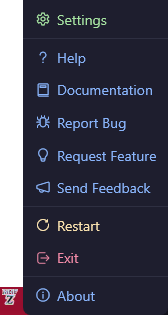

### Quick Troubleshooting

- If the overlay doesn't seem to load values properly, restart it. If that didn't fix the issue, [please send information here](https://github.com/DorielRivalet/mhfz-overlay/issues).

- Additionally, if information from the overlay is wrong or inaccurate (*e.g.* monster parts labels), feel free to send an issue.

- If the monster HP shown is less than what its actual values should be, restart both the game and the overlay. If the HP shows 0/1 then change area for it to load. If the issue still occurs, change the Effective HP Corrector's minimum and maximum thresholds or disable Effective HP, otherwise send a bug report if there isn't already one.

- If you want the overlay to use the least memory possible, you can decide to not open the configuration window. If you want to change settings, then open the configuration window, edit settings, click save and restart the overlay.

- Fully reinstalling the game or .NET dependencies may fix some bugs.

- Press `Alt+Enter` twice if your screen resolution got lowered.

- If the HP shows 0/1 then change area for it to load.

- If you have screen issues when starting the overlay, first press `Alt+Enter` in-game, load the overlay, then press `Alt+Enter` in-game again. Also make sure that the UAC prompts do not cause issues in your computer, and that you have the correct permissions.

- If you are having performance issues, lower the overlay resolution and refresh rate. Also try setting Rendering Mode to Software or Hardware.

## Features

- [x] Monster Effective HP Bars (*e.g.* Burning Freezing Elzelion's 1,000,000 HP!).

You can also see the monster icons or renders, and there is an option for automatic bar colors depending on the monster!

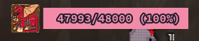

- [x] Sharpness Numbers (colorized by current sharpness tier!).

- [x] Quest Timer (Two modes: elapsed time and time left. Down to the centiseconds in accuracy!).
- [x] Hit Count (counts *Reflect*, *Stylish Up*, Heatblade, *Fencing+2* and more!).

Includes icons!

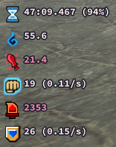

- [x] Player Input (KBM).

- [x] Player Stats Graphs (Actions per Minute, Damage Per Second, Hits per Second and True Raw!).

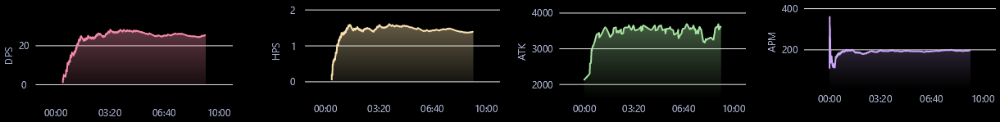

- [x] Player True Raw (currently highest value shown in red!).

- [x] Monster Stats + Icons (attack multiplier, defense rate and size!).

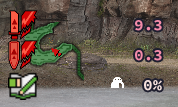

- [x] Monster Status Ailments + Icons (Poison, Sleep, Paralysis, Blast, Stun!).

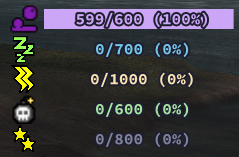

- [x] Monster Body Parts (up to 10 parts!).

- [x] Damage Numbers (dynamic colors and size!).

- [x] [Discord Rich Presence](./FAQ.md/#how-to-enable-discord-rich-presence) (custom monster icons, colored weapons, quest tier, current area, [speedrun mode, zen mode](./FAQ.md/#how-to-enable-speedrun-categories--zen-mode), and more!).

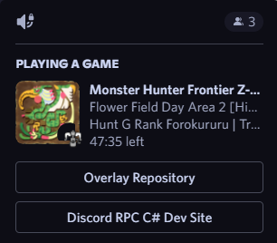

- [x] Run Category Watermarks and Personal Best Times for your speedrun videos!

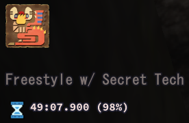

- [x] Quest Runs Database (check weapon usage, set YouTube URLs, view past statistics, etc.!)

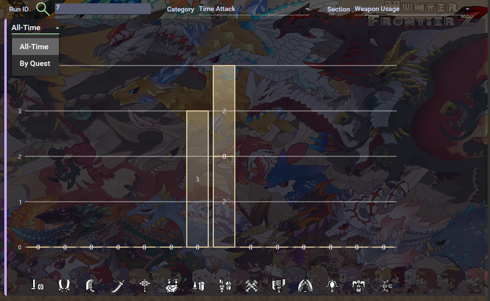

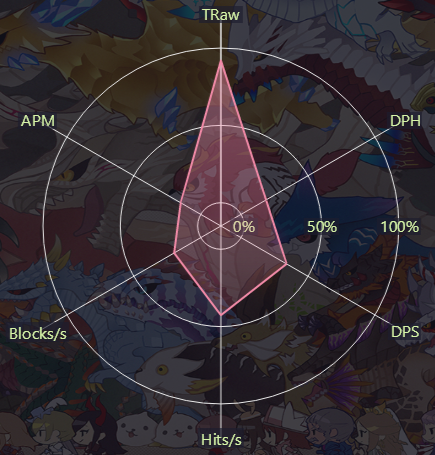

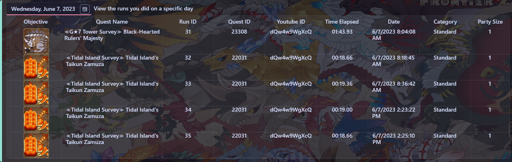

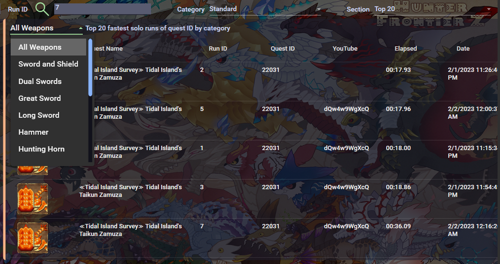

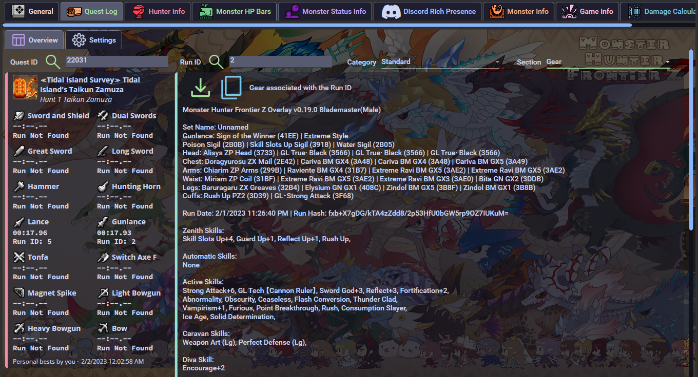

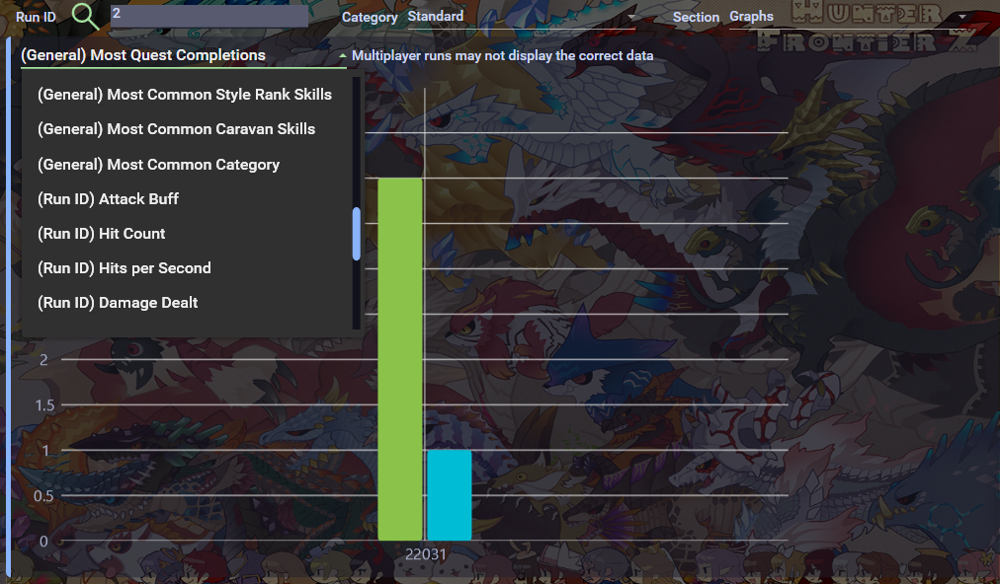

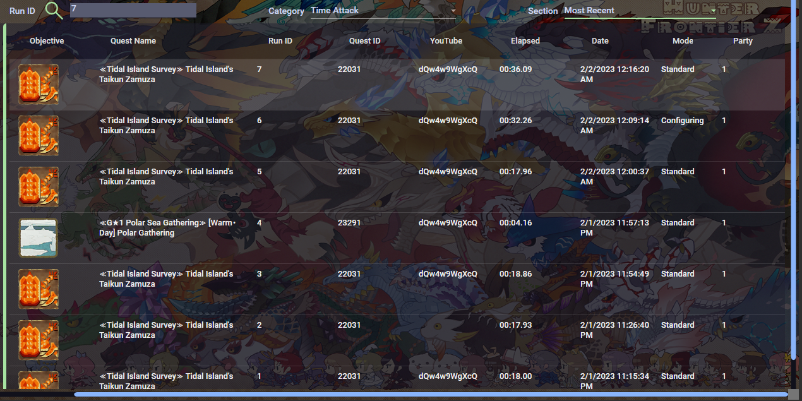

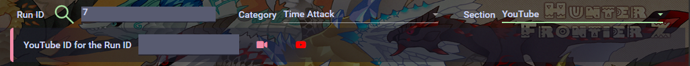

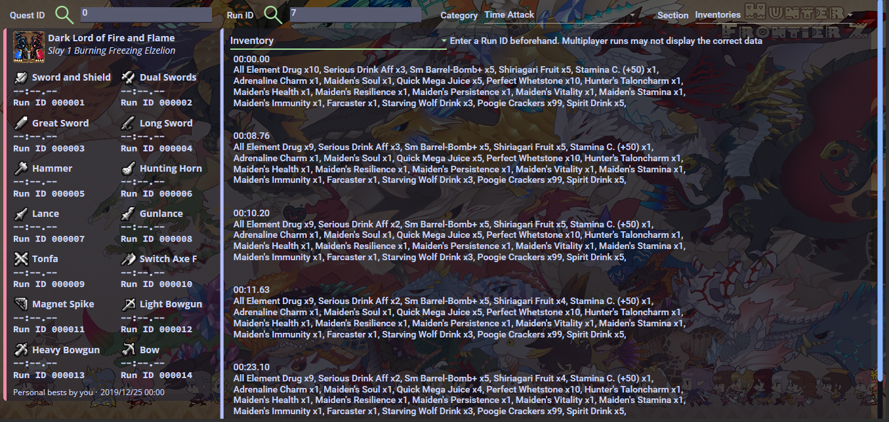

- [x] Also includes personal best times by date and by attempts! The total frames elapsed are shown in the graph.

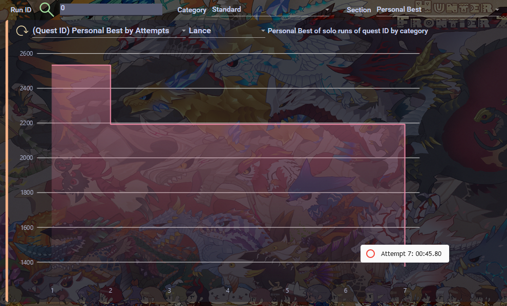

**Important**: It is recommended to make a backup of the `MHFZ_Overlay.sqlite` file periodically. The file is located inside the database folder, which is inside your game folder.

## Configuration Preview

These images don't show everything, find out what's missing by pressing `Shift+F1`!

### Hunter Sets (Text)

### Hunted Logs

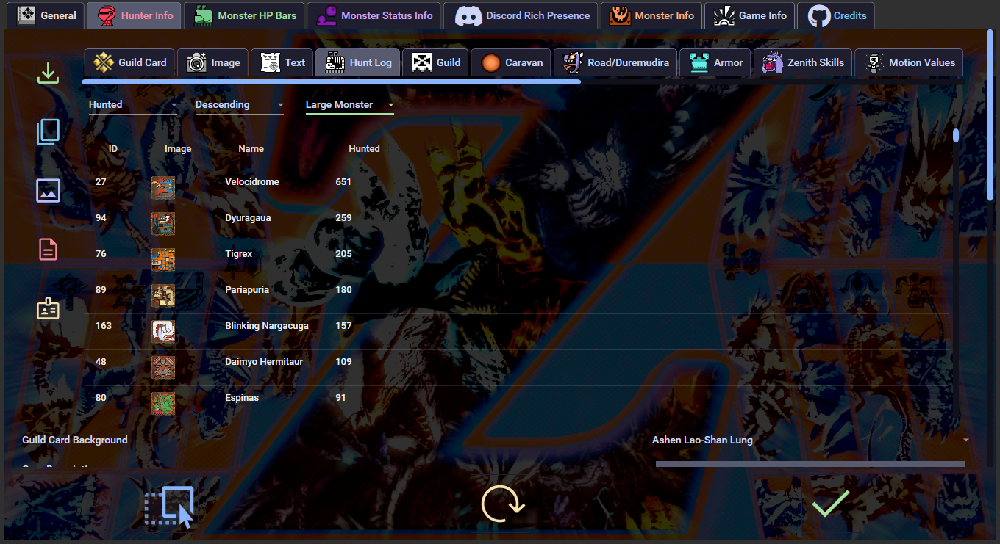

### Monster Speedruns, Hitzones and Wiki

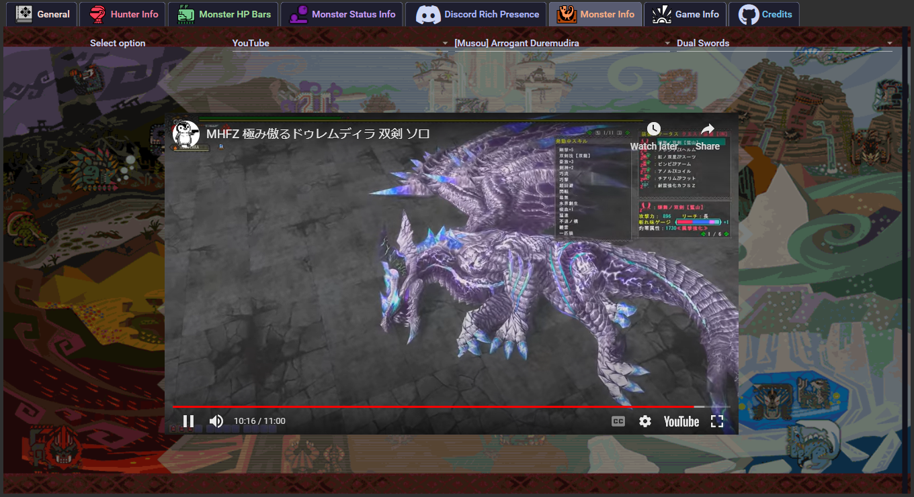

### Ferias

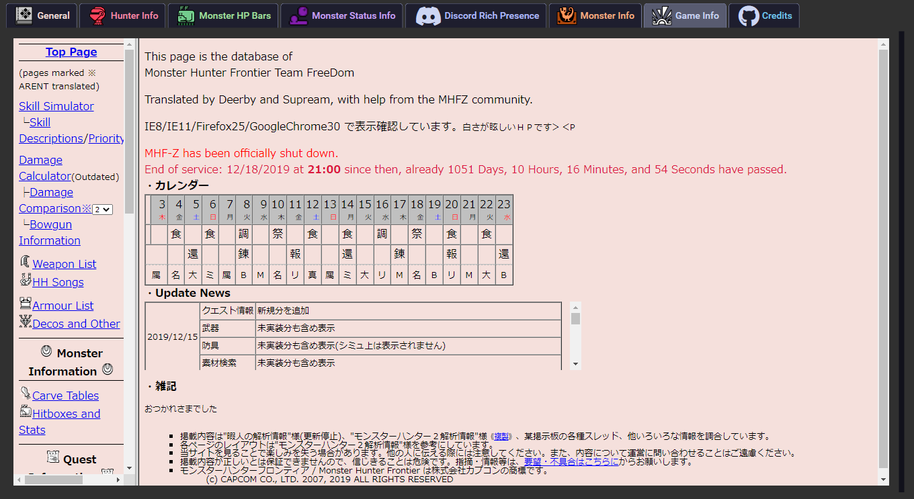

### Guild Card

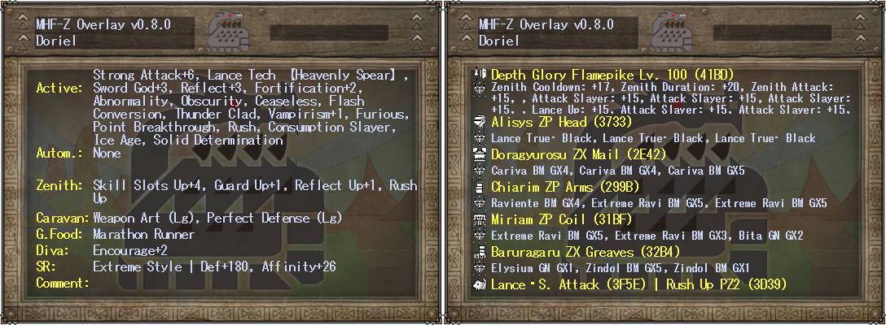

### Hunter Sets (Image)

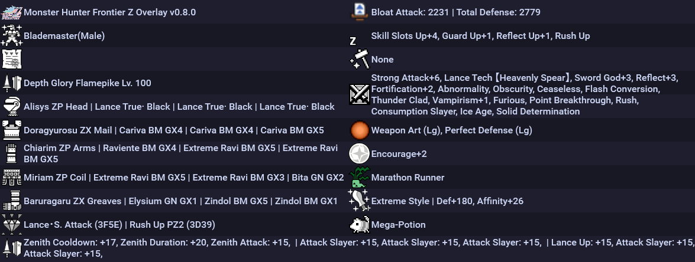

### Damage Calculator

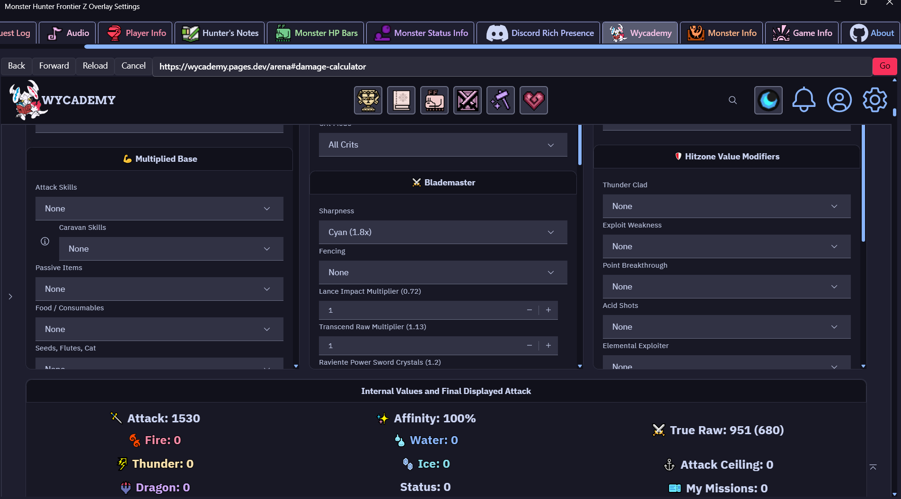

## Features not yet implemented

- Choose which player to load data from.
- Auto detect which player is playing.
- Selecting monsters for body parts and monster status.
- Allow lock-on to be used to select monsters.
- Add shortcut for saving.
- Automatically set default positions according to screen resolution.
- Global damage number labels.
- Attach user interface to game window option.
- Sharpness graph.
- Language options.
- PvP addresses.
- Handle multiple objectives information.
- Zenith information in Road.
- Raviente Support Part Info.
- Detect UL/HC.
- Guild Pugi address.
- Armor Set Website links.
- Sky Corridor.
- Drag and Drop multiple selection.
- Sharpness tables.
- Gear rarity colors in hunter info stats.

[Check more possible future features here](https://github.com/DorielRivalet/mhfz-overlay/issues?q=is%3Aissue+is%3Aopen+label%3Aenhancement).

## Bugs

- Monster stats are sometimes outside of the screen (if they don't show at all even if you open the config menu, this is probably your issue).
- With Monster EHP enabled, if you cart, the max EHP turns into the current EHP, along with some other stats max values.
- Sometimes when exiting Drag and Drop the monster HP information disappears.
- Spawning in the same area as the monster doesn't load the information properly. Fix: re-enter area.
- Duremudira/Road/Raviente HP not showing. Fix: enable *Always Show Monster Info*, load another quest showing the HP bars (not just the numbers), then retry.
- Monster size values not shown correctly.
- Monster HP values are less than the actual values when not loading properly.
- Damage numbers over 1000 not working.
- Yamas and Berukyurosu information not working.

[Check more bugs here](https://github.com/DorielRivalet/mhfz-overlay/issues?q=is%3Aissue+is%3Aopen+label%3Abug).

## Frequently Asked Questions

[FAQ](https://github.com/DorielRivalet/mhfz-overlay/blob/main/FAQ.md).

## How to Manually Update with Update.exe

`update.exe --update https://www.github.com/DorielRivalet/mhfz-overlay/releases/download/ENTER VERSION NUMBER (e.g. v0.6.4)`

## How to Uninstall

1. Go to Apps & Features.
2. Search Monster Hunter Frontier Z Overlay.
3. Click Uninstall. You can also delete the Desktop shortcut and Start Menu icon after uninstalling.

## Changelog

[Learn about the latest improvements](https://github.com/DorielRivalet/mhfz-overlay/blob/main/CHANGELOG.md).

## Documentation

This repository includes two main documentation files:

- **`FAQ.md`**: This file is meant for end-users and provides information about how to use and troubleshoot the software. If you're new to the software, we recommend starting here.

- **`docs/README.md`**: This file is meant for developers and technical users who are contributing to the project or working on the codebase. It contains information about the software's intricacies, as well as instructions for deploying the project.

We recommend consulting the appropriate documentation file based on your needs. If you have any questions or issues, feel free to [contact us](https://github.com/DorielRivalet/mhfz-overlay/issues/new/choose) for support.

## Contributing

[Learn about how to contribute](https://github.com/DorielRivalet/mhfz-overlay/blob/main/CONTRIBUTING.md).

## Project Development

[GitHub Projects](https://github.com/DorielRivalet/mhfz-overlay/projects?query=is%3Aopen).

## Code Analysis

## Repository Overview

## Feedback

[Google Forms](https://forms.gle/hrAVWMcYS5HEo1v7A).

## License

[MIT](https://github.com/DorielRivalet/mhfz-overlay/blob/main/LICENSE.md).

## Acknowledgements

- This project is directly inspired from the overlay created by [*suzaku01*](https://github.com/suzaku01/mhf_displayer).
- The theme and color palette used for the application is [*Catppuccin Mocha*](https://github.com/catppuccin/catppuccin).
- The design and icons used in this project are part of [*Segoe Fluent Icons*](https://learn.microsoft.com/en-us/windows/apps/design/style/segoe-fluent-icons-font) and [WPF UI](https://github.com/lepoco/wpfui).
- The fonts used is the in-game one, *MS Gothic*. For monospaced, the application uses Source Code Pro and MesloLGM NF. This project also uses Font Awesome's fonts. The Monster Hunter font made by XMitsarugiX comes from [here](https://www.deviantart.com/xmitsarugix/art/Monster-Hunter-Font-Type-1-and-2-380816151).

