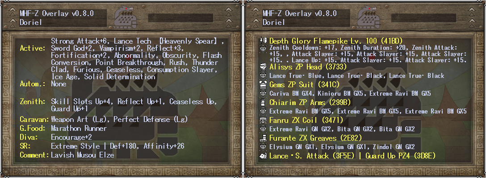
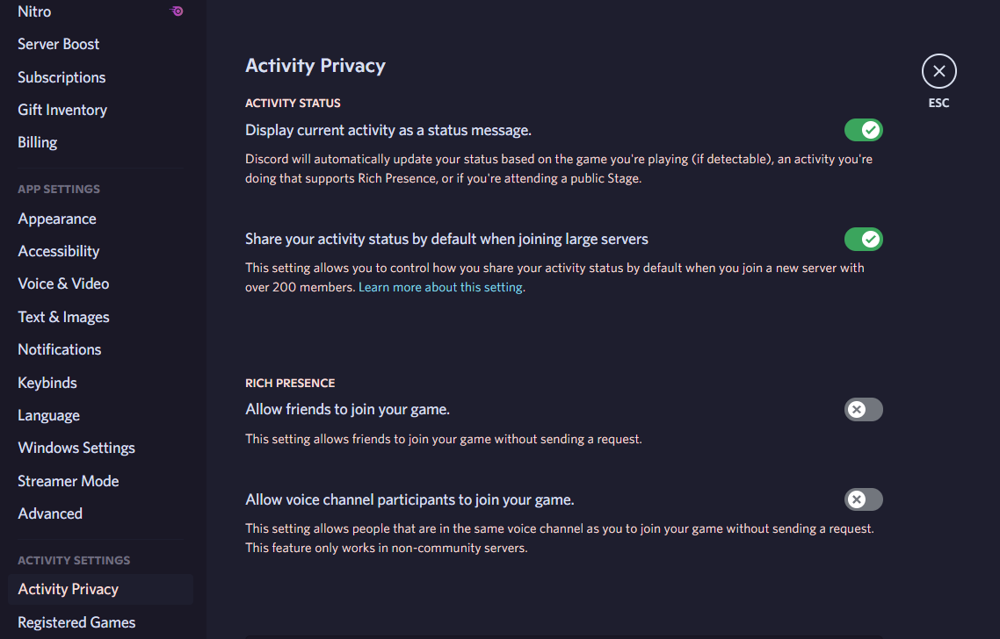
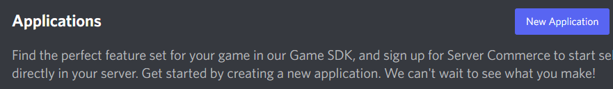
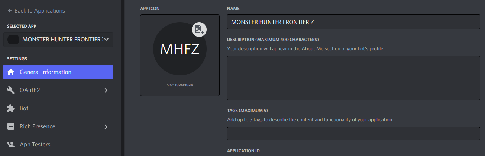

# Monster Hunter Frontier Z Overlay

---

**[<kbd>   :rocket: Install   </kbd>](#installation)** 
**[<kbd>   📘 Hotkeys  </kbd>](#hotkeys)** 
**[<kbd>   🕹 Features   </kbd>](#features)** 

---

## About

This project aims to provide a simple, customizable overlay for Monster Hunter Frontier Z on Windows, with the added bonus of Discord Rich Presence integration. The overlay allows players to keep track of their in-game stats and progress, as well as providing a convenient way to access various tools and resources.

The overlay is highly configurable, with a wide range of options available to suit the needs of individual players and speedrunners alike. It is also constantly being updated and improved, so be sure to check back for the latest features and fixes.

We hope you find this overlay useful and enjoyable, and we welcome any feedback or suggestions you may have. Happy hunting!

[This project is directly inspired from the overlay created by *suzaku01*](https://github.com/suzaku01/mhf_displayer)

[The theme and color palette used for the application is *Catppuccin Mocha*](https://github.com/catppuccin/catppuccin)

[The design and icons used in this project are part of the *Material Design Icons* and related components](https://fonts.google.com/icons)

The fonts used is the in-game one, *MS Gothic*, and Source Code Pro for monospaced. This project also uses Font Awesome's fonts.

## Requirements

- [.NET Desktop Runtime 6.0 x64](https://dotnet.microsoft.com/en-us/download/dotnet/thank-you/runtime-desktop-6.0.7-windows-x64-installer)
- [.NET Desktop Runtime 6.0 x86](https://dotnet.microsoft.com/en-us/download/dotnet/thank-you/runtime-desktop-6.0.8-windows-x86-installer)

## Installation

1. [Get **ALL** of the requirements](#requirements)
2. [Download the latest version from the *Releases*](https://github.com/DorielRivalet/mhfz-overlay/releases/latest/download/Releases.7z)
3. Make sure Windows or your antivirus did not delete the files (because it reads the games memory, Windows might detect it as a trojan, so you might have to get it out of quarantine)
4. Unzip it anywhere. Run `mhfz-overlaySetup.exe` **as Administrator**
5. [Bonk monsters!](https://c.tenor.com/60Tr3Zeg6RkAAAAd/fumo-bonk.gif)
6. [Be sure to leave some feedback here!](https://forms.gle/hrAVWMcYS5HEo1v7A)

[View CHANGELOG.md](https://github.com/DorielRivalet/mhfz-overlay/blob/main/CHANGELOG.md)

[View Release Statistics](https://somsubhra.github.io/github-release-stats/?username=DorielRivalet&repository=mhfz-overlay&page=1&per_page=30)

## Hotkeys

- `Shift+F1` Open Configuration
- `Shift+F5` Restart Overlay
- `Shift+F6` Exit

**It's recommended to start the overlay when you are done loading into Mezeporta.**

If the overlay doesn't seem to load values properly, restart it. If that didn't fix the issue, [please send information here](https://github.com/DorielRivalet/mhfz-overlay/issues).

Additionally, if information from the overlay is wrong or inaccurate (e.g. monster parts labels), feel free to send an issue.

If the monster HP shown is less than what its actual values should be, restart both the game and the overlay. If the HP shows 0/1 then change area for it to load. If issue still occurs, disable Effective HP, otherwise send a bug report if there isn't already one.

## Features

- [x] Monster Effective HP Bars (*e.g.* Burning Freezing Elzelion's 1,000,000 HP!)

- [x] Sharpness Numbers (colorized by current sharpness tier!)

- [x] Quest Timer (Two modes: elapsed time and time left. Down to the centiseconds in accuracy!)
- [x] Hit Count (counts *Reflect*, *Stylish Up*, Heatblade, *Fencing+2* and more!)

- [x] Player True Raw (current highest value shown in red!)

- [x] Monster Stats (attack multiplier, defense rate and size!)

- [x] Monster Status Ailments (Poison, Sleep, Paralysis, Blast, Stun!)

- [x] Monster Body Parts (up to 10 parts!)

- [x] Damage Numbers (dynamic colors and size!)

- [x] [Discord Rich Presence](#how-to-enable-discord-rich-presence) (custom monster icons, colored weapons, quest tier, current area, [speedrun mode, zen mode](#how-to-enable-speedrun--zen-modes), and more!)

## Configuration Preview

These images don't show everything, find out what's missing by pressing `Shift+F1`!

### Hunter Sets (Text)

### Hunted Logs

### Monster Speedruns, Hitzones and Wiki

### Ferias

### Guild Card

### Hunter Sets (Image)

### Damage Calculator

## Bugs

- Monster Infos are sometimes outside of the screen (if they don't show at all even if you open the config menu, this is probably your issue)
- With Monster EHP enabled, if you cart, the max EHP turns into the current EHP, along with some other info max values
- Sometimes when exiting Drag and Drop the monster HP information disappears
- Spawning in the same area as the monster doesn't load the information properly. Fix: re-enter area
- Duremudira/Road/Raviente HP not showing. Fix: enable *Always Show Monster Info*, load another quest showing the HP bars (not just the numbers), then retry.
- Monster size values not shown correctly
- Monster HP values are less than the actual values when not loading properly
- Damage numbers over 1000 not working
- Yamas and Berukyurosu information not working

Fully reinstalling the game or .NET dependencies may fix some bugs.

Starting the overlay may take a bit of time because of the dictionaries (*i.e.* **all** in-game gear and items) and other features.

Press `Alt+Enter` twice if your screen resolution got lowered.

If the HP shows 0/1 then change area for it to load.

[Check more bugs here](https://github.com/DorielRivalet/mhfz-overlay/issues?q=is%3Aissue+is%3Aopen+label%3Abug)

## Features not yet implemented

- Choose which player to load data from
- Auto detect which player is playing
- Selecting monsters for body parts and monster status
- Fix max HP for Road
- Allow lock-on to be used to select monsters
- Overlay font options
- Add shortcut for saving
- Damage graph
- Weapon stats import/export
- Quest stats import/export
- Monster stats import/export
- Automatically set default positions according to screen resolution
- Global damage number labels
- Attach user interface to game window option
- Sound effects
- Sharpness graph
- Language options
- PvP addresses
- Handle multiple objectives information
- Zenith information in Road
- Settings import/export
- Raviente Support Part Info
- Detect UL/HC
- Guild Pugi address
- Performance improvements
- Armor Set Website links
- Sky Corridor
- Drag and Drop multiple selection
- Sharpness tables
- Gear rarity colors in hunter info stats

[Check more possible future features here](https://github.com/DorielRivalet/mhfz-overlay/issues?q=is%3Aissue+is%3Aopen+label%3Aenhancement)

## How to Enable Discord Rich Presence

- In Discord, My Account -> Activity Privacy -> Check "Display current activity as a status message"

- [Discord Developer Portal](https://discord.com/developers/applications) -> New Application -> Name it "MONSTER HUNTER FRONTIER Z"

- In Developer Portal, General Information -> Copy Application ID

- In Overlay Settings, Paste into Overlay Settings Discord Rich Presence Application/Client ID (The ID also shows up in OAuth2 section as Client ID)

## How to Enable Speedrun & Zen Modes

- Speedrunner Mode: Disable **everything** (Monster Icon, Quest Timer and Discord Rich Presence optional)

- Zen Mode: Disable **everything** (Monster Icon and Discord Rich Presence optional)

~~Congrats, now you won't be accused of cheating~~

## How to Manually Update with Update.exe

`update.exe --update https://www.github.com/DorielRivalet/mhfz-overlay/releases/download/ENTER VERSION NUMBER (E.G. v0.6.4)`

## How to Uninstall

1. Go to Apps & Features
2. Search Monster Hunter Frontier Z Overlay
3. Click Uninstall. You can also delete the Desktop shortcut and Start Menu icon after uninstalling.

## Changelog

[CHANGELOG](https://github.com/DorielRivalet/mhfz-overlay/blob/main/CHANGELOG.md)

## License

[MIT](https://github.com/DorielRivalet/mhfz-overlay/blob/main/LICENSE.md)

## Code Analysis

## Feedback

[Google Forms](https://forms.gle/hrAVWMcYS5HEo1v7A)
