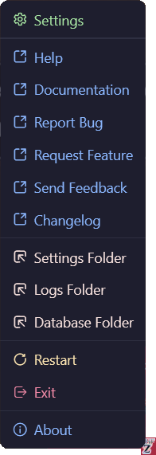
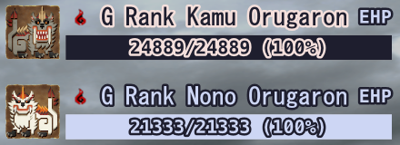
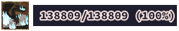
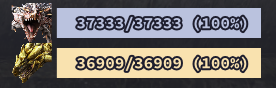
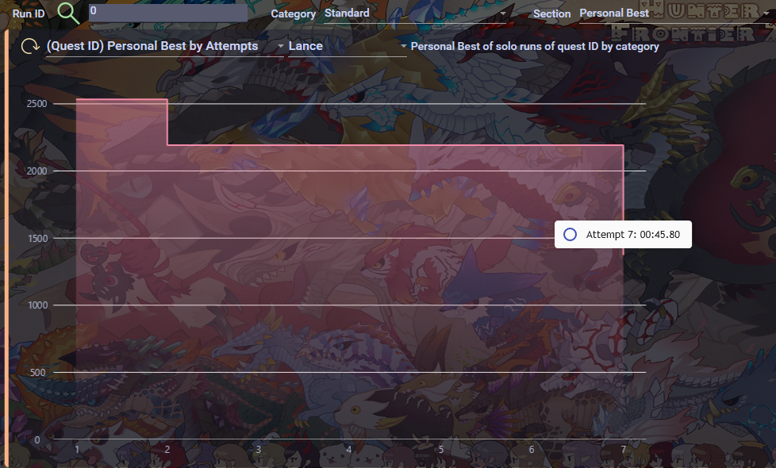
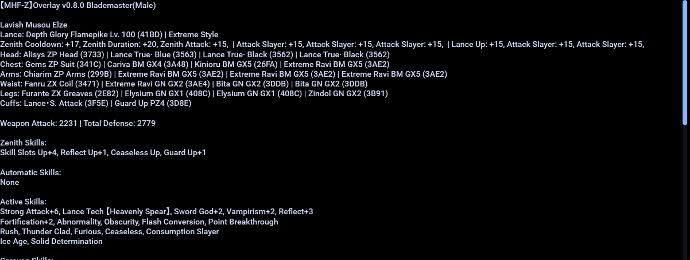
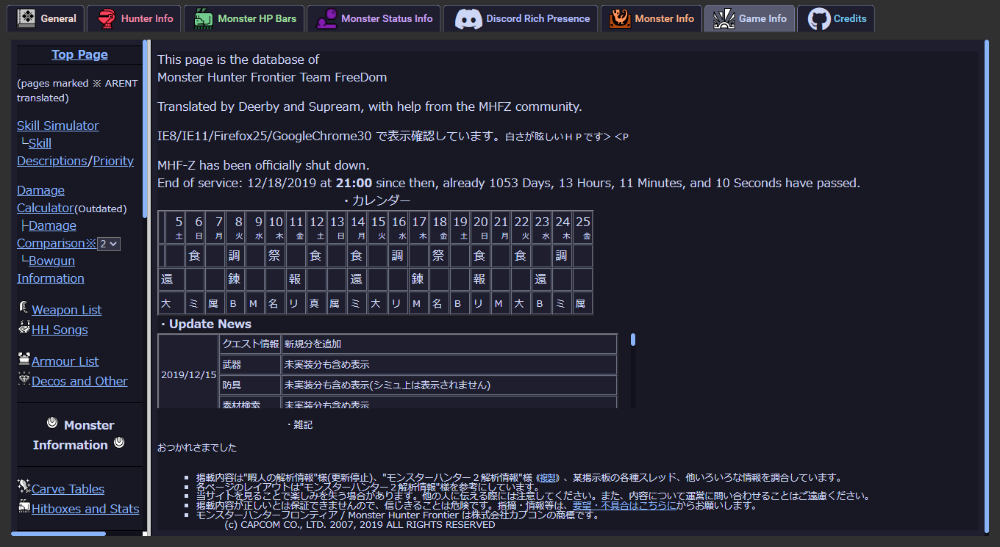
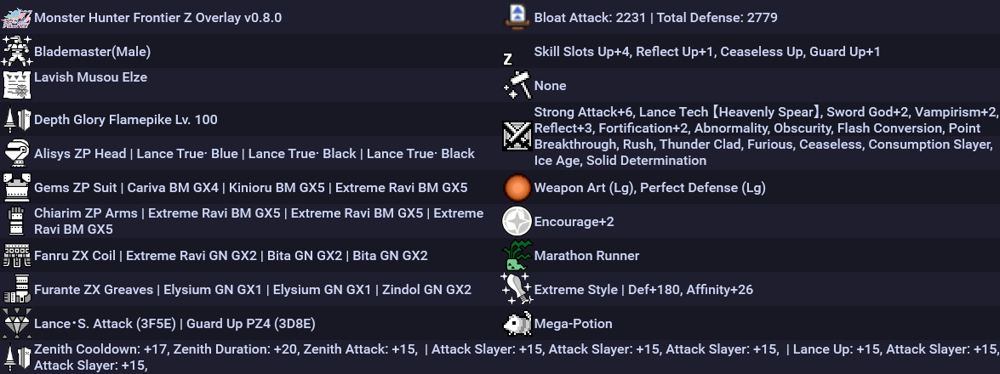

# Monster Hunter Frontier Z Overlay

---

**[<kbd>   :rocket: Install   </kbd>](#installation)** 
**[<kbd>   📘 Hotkeys  </kbd>](#hotkeys)** 
**[<kbd>   🕹 Features   </kbd>](#features)** 

---

## About

This project aims to provide a simple, customizable overlay for Monster Hunter Frontier Z on Windows, with the added bonus of Discord Rich Presence integration. The overlay allows players to keep track of their in-game stats and progress, as well as providing a convenient way to access various tools and resources.

The overlay is highly configurable, with a wide range of options available to suit the needs of individual players and speedrunners alike. It is also constantly being updated and improved, so be sure to check back for the latest features and fixes.

We hope you find this overlay useful and enjoyable, and we welcome any feedback or suggestions you may have. Happy hunting!

## Requirements

- [.NET Desktop Runtime 6.0 x64](https://dotnet.microsoft.com/en-us/download/dotnet/thank-you/runtime-desktop-6.0.7-windows-x64-installer)
- [.NET Desktop Runtime 6.0 x86](https://dotnet.microsoft.com/en-us/download/dotnet/thank-you/runtime-desktop-6.0.8-windows-x86-installer)

## Installation

1. [Get **ALL** of the requirements](#requirements)
2. [Download the latest version from the *Releases*](https://github.com/DorielRivalet/mhfz-overlay/releases/latest/download/MHFZ_OverlaySetup.exe)
3. Make sure *Windows* or your antivirus did not delete the file (because it reads the game's memory, *Windows* might detect it as a trojan, so you might have to get it out of quarantine)
4. Run `MHFZ_OverlaySetup.exe` **as Administrator**
5. [Bonk monsters!](https://c.tenor.com/60Tr3Zeg6RkAAAAd/fumo-bonk.gif)
6. [Be sure to leave some feedback here!](https://forms.gle/hrAVWMcYS5HEo1v7A)

### DISCLAIMER

If you obtained the mhfz-overlay software from any source other than GitHub releases, please be aware that there are no guarantees that the program has the same code as the version in this repository, nor that it was created by the same individual(s), or that it represents the latest version.

We strongly recommend that you verify the authenticity and integrity of the software by comparing the SHA-256 checksum we provide against the checksum of the software you have obtained. The SHA-256 checksum can be found in the GitHub release notes and can be used to ensure that the software you are using matches the code in this repository. We assume no responsibility for any issues or problems that may arise from the use of software obtained from other sources.

[How to check the downloaded file hashes](https://github.com/DorielRivalet/mhfz-overlay/blob/main/FAQ.md#how-to-check-the-downloaded-file-hashes)

[View CHANGELOG.md](https://github.com/DorielRivalet/mhfz-overlay/blob/main/CHANGELOG.md)

[View Release Statistics](https://somsubhra.github.io/github-release-stats/?username=DorielRivalet&repository=mhfz-overlay&page=1&per_page=30)

## Hotkeys

- `Shift+F1` Open Configuration
- `Shift+F5` Restart Overlay
- `Shift+F6` Exit

As an alternative to hotkeys, you can check your system tray options by right-clicking the icon.

**It's recommended to start the overlay when you are done loading into Mezeporta.**

If the overlay doesn't seem to load values properly, restart it. If that didn't fix the issue, [please send information here](https://github.com/DorielRivalet/mhfz-overlay/issues).

Additionally, if information from the overlay is wrong or inaccurate (e.g. monster parts labels), feel free to send an issue.

If the monster HP shown is less than what its actual values should be, restart both the game and the overlay. If the HP shows 0/1 then change area for it to load. If issue still occurs, disable Effective HP, otherwise send a bug report if there isn't already one.

## Features

- [x] Monster Effective HP Bars (*e.g.* Burning Freezing Elzelion's 1,000,000 HP!)

You can also see the monster icons or renders, and there is an option for automatic bar colors depending on the monster!

- [x] Sharpness Numbers (colorized by current sharpness tier!)

- [x] Quest Timer (Two modes: elapsed time and time left. Down to the centiseconds in accuracy!)
- [x] Hit Count (counts *Reflect*, *Stylish Up*, Heatblade, *Fencing+2* and more!)

Includes icons!

- [x] Player Input (KBM)

- [x] Player Stats Graphs (Actions per Minute, Damage Per Second, Hits per Second and True Raw!)

- [x] Player True Raw (currently highest value shown in red!)

- [x] Monster Stats + Icons (attack multiplier, defense rate and size!)

- [x] Monster Status Ailments + Icons (Poison, Sleep, Paralysis, Blast, Stun!)

- [x] Monster Body Parts (up to 10 parts!)

- [x] Damage Numbers (dynamic colors and size!)

- [x] [Discord Rich Presence](./FAQ.md/#how-to-enable-discord-rich-presence) (custom monster icons, colored weapons, quest tier, current area, [speedrun mode, zen mode](./FAQ.md/#how-to-enable-speedrun-categories--zen-mode), and more!)

- [x] Run Category Watermarks and Personal Best Times for your speedrun videos!

- [x] Quest Runs Database (check weapon usage, set YouTube URLs, view past statistics, etc.!)

- [x] Also includes personal best times by date and by attempts! The total frames elapsed are shown in the graph.

**Important**: It is recommended to make a backup of the `MHFZ_Overlay.sqlite` file periodically. The file is located inside the database folder, which is inside your game folder.

## Configuration Preview

These images don't show everything, find out what's missing by pressing `Shift+F1`!

### Hunter Sets (Text)

### Hunted Logs

### Monster Speedruns, Hitzones and Wiki

### Ferias

### Guild Card

### Hunter Sets (Image)

### Damage Calculator

## Features not yet implemented

- Choose which player to load data from
- Auto detect which player is playing
- Selecting monsters for body parts and monster status
- Fix max HP for Road
- Allow lock-on to be used to select monsters
- Add shortcut for saving
- Automatically set default positions according to screen resolution
- Global damage number labels
- Attach user interface to game window option
- Sound effects
- Sharpness graph
- Language options
- PvP addresses
- Handle multiple objectives information
- Zenith information in Road
- Raviente Support Part Info
- Detect UL/HC
- Guild Pugi address
- Performance improvements
- Armor Set Website links
- Sky Corridor
- Drag and Drop multiple selection
- Sharpness tables
- Gear rarity colors in hunter info stats

[Check more possible future features here](https://github.com/DorielRivalet/mhfz-overlay/issues?q=is%3Aissue+is%3Aopen+label%3Aenhancement)

## Bugs

- Monster Infos are sometimes outside of the screen (if they don't show at all even if you open the config menu, this is probably your issue)
- With Monster EHP enabled, if you cart, the max EHP turns into the current EHP, along with some other info max values
- Sometimes when exiting Drag and Drop the monster HP information disappears
- Spawning in the same area as the monster doesn't load the information properly. Fix: re-enter area
- Duremudira/Road/Raviente HP not showing. Fix: enable *Always Show Monster Info*, load another quest showing the HP bars (not just the numbers), then retry.
- Monster size values not shown correctly
- Monster HP values are less than the actual values when not loading properly
- Damage numbers over 1000 not working
- Yamas and Berukyurosu information not working

Fully reinstalling the game or .NET dependencies may fix some bugs.

Starting the overlay may take a bit of time because of the dictionaries (*i.e.* **all** in-game gear and items) and other features.

Press `Alt+Enter` twice if your screen resolution got lowered.

If the HP shows 0/1 then change area for it to load.

[Check more bugs here](https://github.com/DorielRivalet/mhfz-overlay/issues?q=is%3Aissue+is%3Aopen+label%3Abug)

## Frequently Asked Questions

[FAQ](https://github.com/DorielRivalet/mhfz-overlay/blob/main/FAQ.md)

## How to Manually Update with Update.exe

`update.exe --update https://www.github.com/DorielRivalet/mhfz-overlay/releases/download/ENTER VERSION NUMBER (E.G. v0.6.4)`

## How to Uninstall

1. Go to Apps & Features
2. Search Monster Hunter Frontier Z Overlay
3. Click Uninstall. You can also delete the Desktop shortcut and Start Menu icon after uninstalling.

## Changelog

[Learn about the latest improvements.](https://github.com/DorielRivalet/mhfz-overlay/blob/main/CHANGELOG.md)

## Documentation

This repository includes two main documentation files:

- **`FAQ.md`**: This file is meant for end-users and provides information about how to use and troubleshoot the software. If you're new to the software, we recommend starting here.

- **`docs/README.md`**: This file is meant for developers and technical users who are contributing to the project or working on the codebase. It contains information about the software's intricacies, as well as instructions for deploying the project.

We recommend consulting the appropriate documentation file based on your needs. If you have any questions or issues, feel free to [contact us](https://github.com/DorielRivalet/mhfz-overlay/issues/new/choose) for support.

## Project Development

[GitHub Projects](https://github.com/DorielRivalet/mhfz-overlay/projects?query=is%3Aopen)

## Code Analysis

## Repository Overview

## Feedback

[Google Forms](https://forms.gle/hrAVWMcYS5HEo1v7A)

## License

[MIT](https://github.com/DorielRivalet/mhfz-overlay/blob/main/LICENSE.md)

## Acknowledgements

[This project is directly inspired from the overlay created by *suzaku01*](https://github.com/suzaku01/mhf_displayer)

[The theme and color palette used for the application is *Catppuccin Mocha*](https://github.com/catppuccin/catppuccin)

[The design and icons used in this project are part of the *Material Design Icons* and related components](https://fonts.google.com/icons)

The fonts used is the in-game one, *MS Gothic*, and Source Code Pro for monospaced. This project also uses Font Awesome's fonts. The Monster Hunter font made by XMitsarugiX comes from [here](https://www.deviantart.com/xmitsarugix/art/Monster-Hunter-Font-Type-1-and-2-380816151).

