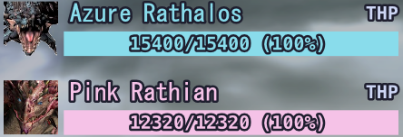

<video controls src="https://user-images.githubusercontent.com/100863878/192533340-8497ec26-96ad-4e4a-b16d-c8f336330ff8.mp4" muted="false"></video>

# MHFZ_Overlay

## About

[This project is directly inspired from the overlay created by *suzaku01*](https://github.com/suzaku01/mhf_displayer)

[The theme and color palette used for the application is *Catppuccin Mocha*](https://github.com/catppuccin/catppuccin)

[The design and icons used in this project are part of the *Material Design Icons* and related components](https://fonts.google.com/icons)

The font used is the in-game one, *MS Gothic*.

## Requirements

- [.NET Desktop Runtime 6.0 x64](https://dotnet.microsoft.com/en-us/download/dotnet/thank-you/runtime-desktop-6.0.7-windows-x64-installer)
- [.NET Desktop Runtime 6.0 x86](https://dotnet.microsoft.com/en-us/download/dotnet/thank-you/runtime-desktop-6.0.8-windows-x86-installer)

## Installation

1. [Get **ALL** of the requirements](#requirements)
2. [Download the latest version from the *Releases*](https://github.com/Imulion/MHFZ_Overlay/releases/latest)
3. Make sure Windows or your antivirus did not delete the `MHFZOverlay.dll` file (because it reads the games memory windows might detect it as a trojan so you might have to get it out of quarantine)
4. Run `MHFZ_Overlay.exe`
5. [Bonk monsters!](https://c.tenor.com/60Tr3Zeg6RkAAAAd/fumo-bonk.gif)

## Hotkeys

- `Shift+F1` Open Configuration
- `Shift+F5` Restart Overlay
- `Shift+F6` Exit

**It's recommended to start the overlay when you are done loading into Mezeporta.**

If the overlay doesn't seem to load values properly, restart it. If that didn't fix the issue, [please send information here](https://github.com/Imulion/MHFZ_Overlay/issues).

Additionally, if information from the overlay is wrong or inaccurate (e.g. monster parts labels), feel free to send an issue.

If the monster HP shown is less than what its actual values should be, restart both the game and the overlay.

## Features

- [x] Monster Effective HP Bars (*e.g.* Burning Freezing Elzelion's 1,000,000 HP!)

- [x] Sharpness Numbers (colorized by current sharpness tier!)

- [x] Quest Timer (Two modes: elapsed time and time left. Down to the centiseconds in accuracy!)
- [x] Hit Count (counts *Reflect*, *Stylish Up*, Heatblade, *Fencing+2* and more!)

- [x] Player True Raw (current highest value shown in red!)

- [x] Monster Stats (attack multiplier, defense rate and size!)

- [x] Monster Status Ailments (Poison, Sleep, Paralysis, Blast, Stun!)

- [x] Monster Body Parts (up to 10 parts!)

- [x] Damage Numbers (dynamic colors and size!)

- [x] [Discord Rich Presence](#how-to-enable-discord-rich-presence) (custom monster icons, colored weapons, quest tier, current area, [speedrun mode, zen mode](#how-to-enable-speedrun--zen-modes), and more!)

## Bugs

- Monster Infos are sometimes outside of the screen (if they don't show at all even if you open the config menu, this is probably your issue)
- Road detection doesn't work all the time (use road override if road in general works for you)
- With Monster EHP enabled, if you cart, the max EHP turns into the current EHP, along with some other info max values
- Sometimes when exiting Drag and Drop the monster HP information disappears
- Spawning in the same area as the monster doesn't load the information properly. Fix: re-enter area
- Duremudira HP not showing. Fix: enable *Always Show Monster Info*, load another quest showing the HP bars (not just the numbers), then retry.
- Monster size values not shown correctly
- Monster HP values are less than the actual values when not loading properly
- Damage numbers over 1000 not working

## Features not yet implemented

- Choose which player to load data from
- Auto detect which player is playing
- Selecting monsters for body parts and monster status
- Fix max HP for Road
- Allow lock-on to be used to select monsters
- Overlay font options
- Add shortcut for saving
- Damage graph
- Weapon stats import/export
- Quest stats import/export
- Monster stats import/export
- Damage numbers Label border
- Automatically set default positions according to screen resolution
- Global damage number labels
- Attach user interface to game window option
- Sound effects
- Sharpness graph
- Language options
- PvP addresses
- Better Hunter's Road icon
- Handle multiple objectives information

## How to Enable Discord Rich Presence

- In Discord, My Account -> Activity Privacy -> Check "Display current activity as a status message"

- [Discord Developer Portal](https://discord.com/developers/applications) -> New Application -> Name it "MONSTER HUNTER FRONTIER Z"

- In Developer Portal, General Information -> Copy Application ID

- In Overlay Settings, Paste into Overlay Settings Discord Rich Presence Application/Client ID (The ID also shows up in OAuth2 section as Client ID)

## How to Enable Speedrun & Zen Modes

- Speedrunner Mode: Disable **everything** (Monster Icon, Quest Timer and Discord Rich Presence optional)

- Zen Mode: Disable **everything** (Monster Icon and Discord Rich Presence optional)

~~Congrats now you won't be accused of cheating~~
