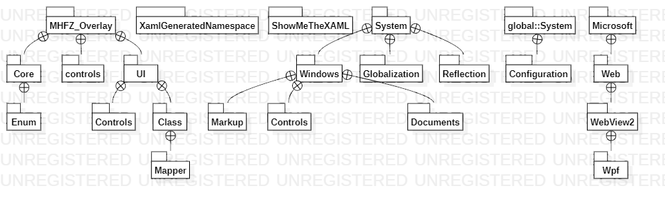
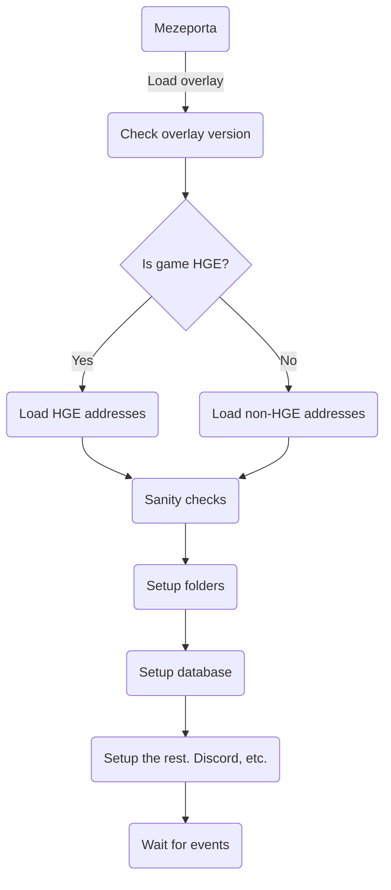
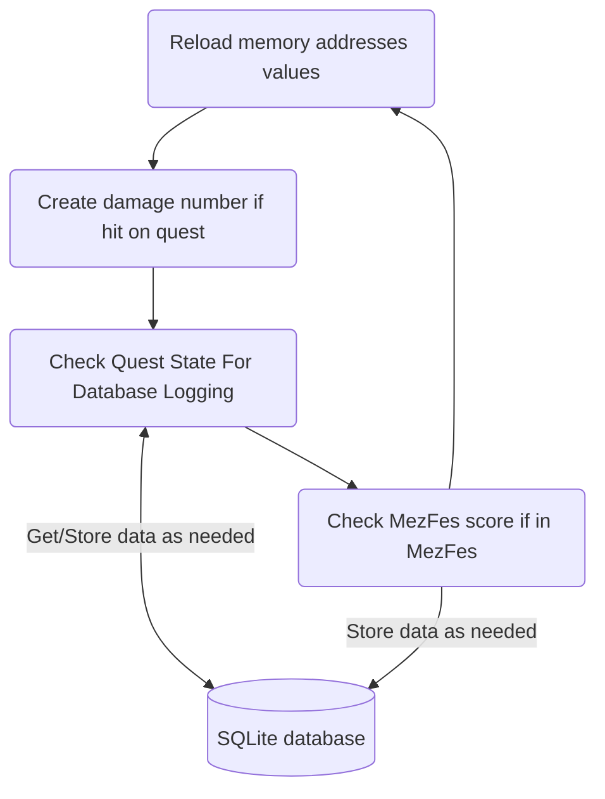
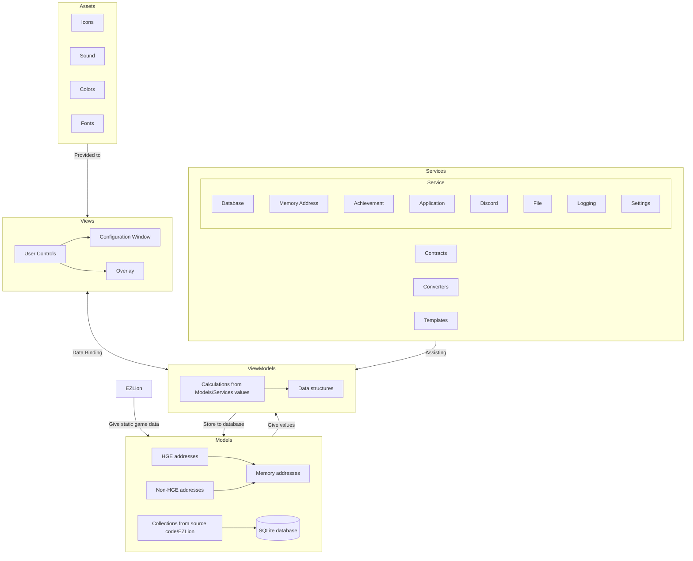

# Documentation

- [Documentation](#documentation)
  - [File Contents](#file-contents)
  - [Overview](#overview)
    - [Model](#model)
    - [ViewModel](#viewmodel)
    - [View](#view)
    - [Service](#service)
  - [scc](#scc)
  - [Graphs](#graphs)
    - [Type Hierarchy](#type-hierarchy)
    - [Package Structure](#package-structure)
    - [Initialization](#initialization)
    - [Main Loop](#main-loop)
    - [Architecture](#architecture)
  - [Closing notes](#closing-notes)

## File Contents

- [Philosophy](./philosophy.md): provides an overview of the direction and purpose of the software, its goals, design principles, and future development plans, as well as guidelines for contributions and notes on its open-source status.
- [CI/CD](./cicd.md): gives a high-level overview of the development workflow, with a list of tasks and the tools used.
- [Database](./database.md): describes the database schema and shows the Entity-Relationship model.
- [Deployment](./deployment.md): details instructions on how to deploy and releasify the application.
- [Classes](./classes.md): displays the class structure of the software.
- [Libraries](./libraries.md): lists the libraries used in this project.
- [Palette](./palette.md): shows a list of RGB and hexadecimal color values with their corresponding labels that were used in the source code.
- [Logging](./logging.md): describes our structured logging implementation and goals.
- [Testing](./testing.md): explains our unit testing implementation and objectives.
- [Performance](./performance.md): elaborates on the performance characteristics and goals.
- [Coding Conventions](./conventions.md): guidelines for programming style, practices, and methods. Includes file organization, indentation, comments, naming conventions, and more. Conventions improve code readability and maintenance.

## Overview

The overlay follows a MVVMS pattern.

### Model

The Model layer consists of various elements:

- **Memory addresses**: Represents the addresses in the game's memory that hold important values.
- **EZLion**: A NuGet package providing static game data, such as gear names and monster names.
- **Collections**: Data structures sourced from EZLion or the overlay's source code, used for storing and manipulating data.
- **SQLite database**: Stores persistent data related to the application.

### ViewModel

The ViewModel layer is responsible for handling the business logic and interaction between the Model and View layers. It performs calculations and transformations on the data to prepare it for presentation.

- ViewModels obtain data from Models and Services, and populate data structures used by the Views.
- Services provide assistance to ViewModels in various domains such as database operations, memory address management, achievement tracking, application functionality, Discord integration, file handling, logging, and settings management.

### View

The View layer represents the user interface components of the application.

- **User Controls**: These are reusable UI components that provide specific functionalities within the application.
- **Configuration Window**: A window that allows users to configure settings and preferences.
- **Overlay**: The main visual component that provides the in-game overlay to the user.

### Service

Services encompass different functionalities required by the application.

- **Database Service**: Handles SQLite queries and operations for data storage and retrieval.
- **Memory Address Service**: Manages the loading and management of memory addresses used by the application.
- **Achievement Service**: Tracks and manages achievements earned by the user.
- **Application Service**: Provides application-level functionality and management.
- **Discord Service**: Integrates with Discord for specific features or interactions.
- **File Service**: Handles file-related operations such as reading, writing, and manipulation.
- **Logging Service**: Manages logging and error handling within the application.
- **Settings Service**: Manages application settings and preferences.

The MVVMS pattern promotes a clear separation of concerns and provides a structured approach to the application's architecture. Models handle the data and its storage, ViewModels handle the logic and preparation of data, Views handle the presentation and user interaction, and Services provide additional functionalities required by the application. This separation enhances maintainability, testability, and flexibility in the application design.

## scc

| Language    | Files | Lines | Blanks | Comments | Code  | Complexity |
|-------------|-------|-------|--------|----------|-------|------------|
| C#          | 86    | 42828 | 3784   | 3669     | 35375 | 4030       |
| XAML        | 69    | 9277  | 297    | 418      | 8562  | 1          |
| Markdown    | 18    | 2629  | 662    | 0        | 1967  | 0          |
| YAML        | 13    | 414   | 27     | 46       | 341   | 0          |
| Plain Text  | 4     | 390   | 46     | 0        | 344   | 0          |
| JSON        | 2     | 17595 | 0      | 0        | 17595 | 0          |
| MSBuild     | 2     | 731   | 14     | 1        | 716   | 1          |
| CSV         | 1     | 178   | 0      | 0        | 178   | 0          |
| JavaScript  | 1     | 135   | 0      | 0        | 135   | 0          |
| Shell       | 1     | 4     | 1      | 1        | 2     | 0          |
| gitignore   | 1     | 224   | 43     | 52       | 129   | 0          |
| Total       | 198   | 74405 | 4874   | 4187     | 65344 | 4032       |

|||
|-|-|
| Estimated Cost to Develop (organic)       | $2,175,511            |
| Estimated Schedule Effort (organic)      | 18.48 months          |
| Estimated People Required (organic)      | 10.46                 |
| Processed                                |4129039 bytes, 4.129 megabytes (SI)|

## Graphs

### Type Hierarchy

### Package Structure

### Initialization

1. Mezeporta, the main entry point, is required to load the overlay properly and checks its version.
2. Based on whether the game is HGE or not, the corresponding addresses are loaded.
3. Sanity checks are performed and necessary folders, databases, and other setups are established.
4. Discord integration and other components are set up.
5. The application waits for events to occur.

### Main Loop

The main loop of the application, affected by the Refresh Rate setting, consists of several steps:

1. Memory addresses are reloaded to obtain updated values.
2. If a hit occurs during a quest, a damage number is created.
3. Quest state is checked for potential database logging.
4. If the game is in MezFes (Mezeporta Festival), MezFes scores are checked and stored if necessary.

### Architecture

The application follows an architectural structure based on the MVVM pattern.

- Assets, such as icons, sound, colors, and fonts, are provided to the Views.
- Views consist of user controls, a Configuration Window and the main Overlay.
- Data binding connects Views and ViewModels, and data is stored to the database from ViewModels.
- ViewModels perform calculations based on values from Models and Services, populating data structures.
- Services are divided into various categories such as Database, Memory Address, Achievement, Application, Discord, File, Logging, and Settings. Services assist ViewModels in performing their tasks.
- EZLion, a NuGet package, provides static game data to the Models.
- Models include memory addresses, HGE and non-HGE addresses, and collections sourced from EZLion. Data is stored in an SQLite database. Models provide values to ViewModels.

## Closing notes

It's important to note that this and other documents are a high-level summary of the components and their interactions, is subject to change, and may or may not be outdated. For a more detailed explanation, you can further expand your understanding of each component and its functionality in the technical documentation files, along with reading the docblocks in source code.

We encourage documentation improvements from the community! For more information, see [how to contribute](../CONTRIBUTING.md).
