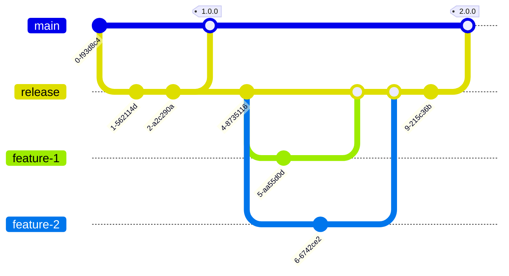

# Releasifying and Deployment Process

## Table of Contents

- [Releasifying and Deployment Process](#releasifying-and-deployment-process)
  - [Table of Contents](#table-of-contents)
  - [Overview](#overview)
    - [Repository branch structure](#repository-branch-structure)
    - [Packaging, Releasifying, Deployment and Distribution Steps](#packaging-releasifying-deployment-and-distribution-steps)
    - [Merging via command line](#merging-via-command-line)

## Overview

The following steps outline the process for releasing and deploying the software using Velopack, after making changes and testing in-game.

### Repository branch structure

The default branch for this repo is [`main`](https://github.com/dorielrivalet/mhfz-overlay/tree/main), which is the latest stable release and has tags for the various releases; e.g., see release tag [0.24.1](https://github.com/dorielrivalet/mhfz-overlay/tree/0.24.1).

Branch [`release`](https://github.com/dorielrivalet/mhfz-overlay/tree/release) is where development occurs between releases and all pull requests should be derived from that branch. The `release` branch is merged back into `main` to cut a release and the release state is tagged (e.g., with `4.10-rc1` or `4.10`).

Visually the process looks roughly like this:

The optional feature branches should not be long-lived. Instead, they should be short-lived and their changes be as atomic as possible. Ideally, they are also tested before being merged into `release`, even if `release` does test them later on.

If you are working on fixes, test your fixes before working on something else. This way, even if you are already commited the fix but it doesn't work, you can do `git commit --amend`. This can also apply for features, other types of work or even unfinished work.

### Packaging, Releasifying, Deployment and Distribution Steps

1. Run `git fetch` to check for the latest remote changes. Then switch to the release branch: Run `git switch release` to switch to the release branch.
2. Pull the latest changes: Run `git pull origin release` to pull the latest changes from the remote release branch.
3. Make changes: Make the necessary changes to the software, and thoroughly test them in-game. Ideally, add unit tests to cover the changes and fix any new bugs with new commits.
4. Bump version: Update the Version in csproj, following SemVer's specifications.
5. Commit changes: Run `git add .` to stage the changes, then run `git commit -m "Your commit message here"` to commit the changes, following commitlint's specifications.
6. Update CHANGELOG.md: Run `npm run release` to automatically update the CHANGELOG.md file with the changes made. When prompted for the tag name, follow Semver's specifications and prefix with a `v`. Answer `Yes` to all except the last question ("Create a Release on GitHub?").
7. Merge release branch into main: **Recommended to send a Pull Request to the main branch**. Otherwise, run `git checkout main` to switch to the main branch and do `git pull origin main` to pull the latest remote changes, then run `git merge release` to merge the release branch into the main branch, and finally `git push origin main`.
8. Verify GitHub Actions: Verify that the GitHub Actions workflow has been triggered and completed successfully. If something is wrong, go back to step 1 and fix any issues without modifying the git history (no rebases and no squashes).
9. Open terminal in `MHFZ_Overlay` project directory and run `dotnet publish -c Release --self-contained -r win-x86 -o publish`.
10. Update packVersion with Velopack: Install `vpk` from Velopack if you don't have it, then run the following command, replacing the packVersion flag with the new version number):
    - `vpk pack --packId MHFZ_Overlay --packDir publish --mainExe "MHFZ_Overlay.exe" --splashImage ../splash.gif --icon mhfzoverlayicon256.ico --packAuthors "DorielRivalet" --packTitle "Monster Hunter Frontier Z Overlay" --packVersion 0.36.0`
11. Add to GitHub Releases: Create a new release on GitHub with the appropriate version number, release notes, and documentation. Lastly, attach all of the files in the generated Releases folder separately (`assets.win.json not needed`).

By following these steps, the software can be releasified and deployed using Velopack, ensuring that the latest changes are packaged and released to users efficiently and reliably. Also, you are allowed to make feature branches and merge them into the release branch.

### Merging via command line

If you do not want to use the merge button or an automatic merge cannot be performed, you can perform a manual merge on the command line. However, the following steps are not applicable if the base branch is protected.

1. Clone the repository or update your local repository with the latest changes.
   - `git@github.com:DorielRivalet/mhfz-overlay.git`
   - `git pull origin main`
2. Switch to the base branch of the pull request.
   - `git checkout main`
3. Merge the head branch into the base branch.
   - `git merge release`
4. Push the changes.
   - `git push -u origin main`
